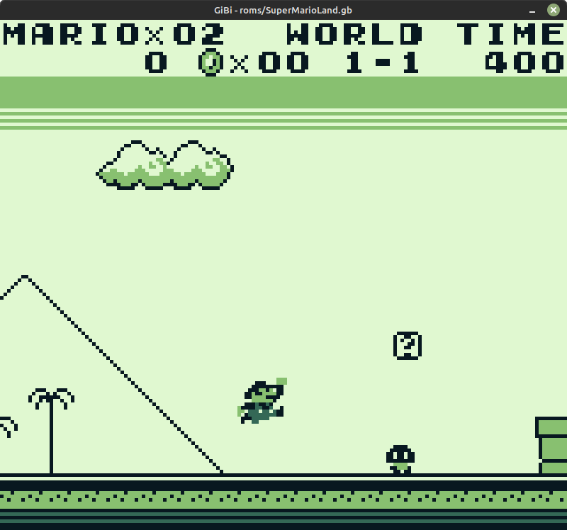
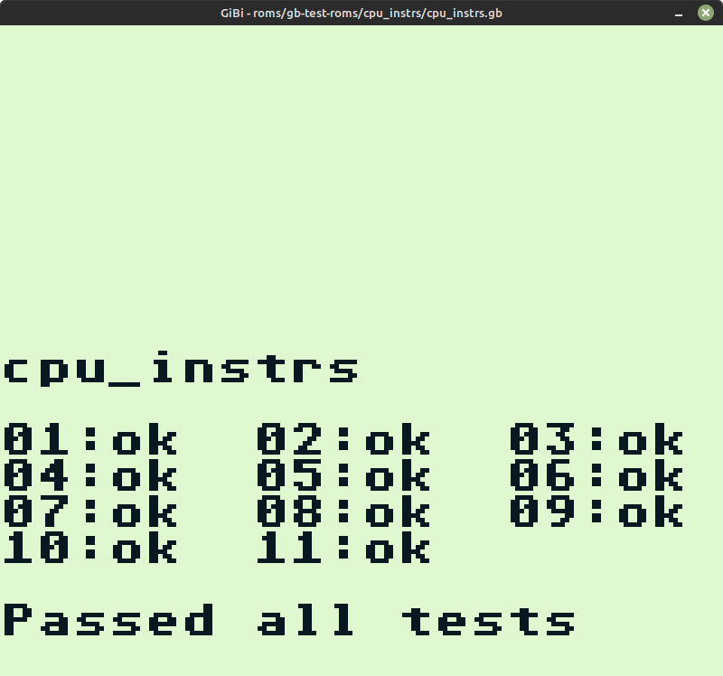

# GiBi - Game Boy Emulator

This is a WIP Game Boy emulator. Currently, it is missing audio, Game Boy Color,
and only No MBC and MBC1 carts are supported. There are also a few bugs in the
PPU and timings.

## Screenshots






## Building and Running

To build you first need to install `SDL2`. On Linux (Ubuntu, Mint) use:

```shell
sudo apt install libsdl2-dev
```

On macOS:

```shell
brew install sdl2
```

It should work on Windows as well. Download the SDL2 developer package and place the files according to the documentation. Place the `SDL2.dll` in the project folder next to the `Cargo.toml` file.

To run use:

```shell
cargo r --release -- <path to rom> -s<scale>
```
