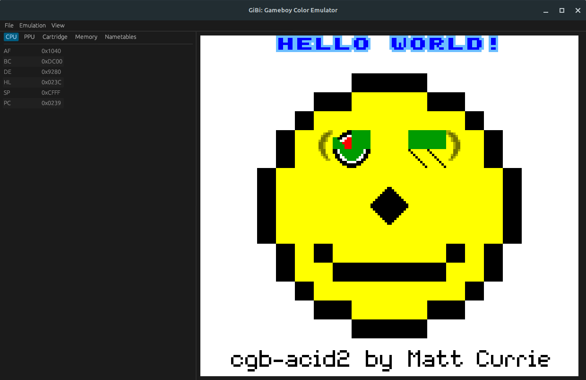

# GiBi - Game Boy Emulator

This is a WIP Game Boy emulator. Currently, it is missing audio, some features required for
Game Boy Color, debug views are incomplete, and only No MBC, MBC1, and MBC5 carts are supported.
There are also a few bugs in the PPU and timings.

## Screenshots




## Building and Running

You need to download the boot ROM for the CGB model from this website:
[https://gbdev.gg8.se/files/roms/bootroms/](https://gbdev.gg8.se/files/roms/bootroms/).
Download and place the `cgb_boot.bin` files in a `roms` directory
next to the `Cargo.toml` file.

To build use:

```shell
cargo build --release
```

To run use:

```shell
cargo run --release
```

## Keys

| Game Boy Key | Keyboard Key |
|--------------|--------------|
| B            | Z            |
| A            | X            |
| Select       | N            |
| Start        | M            |
| Down         | Down         |
| Up           | Up           |
| Left         | Left         |
| Right        | Right        |
