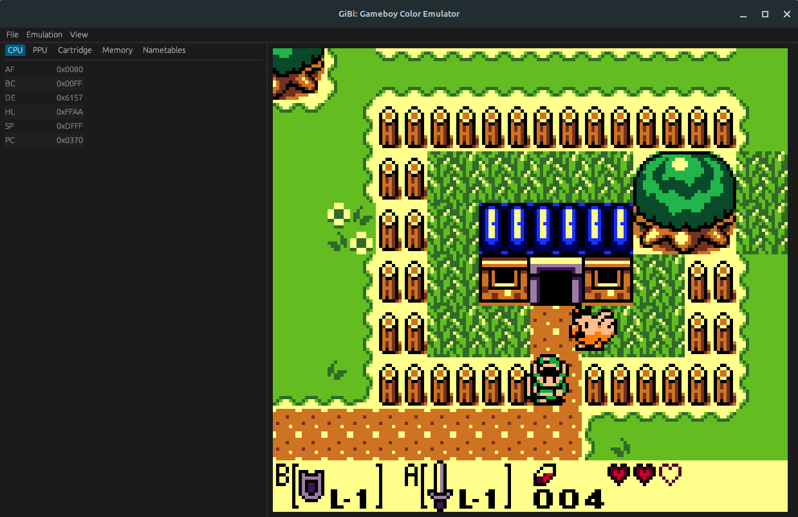

# GiBi - Game Boy Emulator

This is a WIP Game Boy emulator. Currently, it is missing audio, Game Boy Color,
and only No MBC, MBC1, and MBC5 carts are supported. There are also a few bugs in the
PPU and timings.

## Screenshots





## Building and Running

To build you first need to install `SDL2`. On Linux (Ubuntu, Mint) use:

```shell
sudo apt install libsdl2-dev
```

On macOS:

```shell
brew install sdl2
```

It should work on Windows as well. Download the SDL2 developer package and place the files according to the documentation. Place the `SDL2.dll` in the project folder next to the `Cargo.toml` file.

You also need to download the boot ROM for the DMG and CGB model from this website:
[https://gbdev.gg8.se/files/roms/bootroms/](https://gbdev.gg8.se/files/roms/bootroms/).
Download and place the `dmg_boot.bin` and `cgb_boot.bin` files in a `roms` directory
next to the `Cargo.toml` file.

To build use:

```shell
cargo build --release
```

To run use:

```shell
cargo run --release -- <path to rom> -s<scale>
```

## Keys

| Game Boy Key | Keyboard Key |
|--------------|--------------|
| B            | Z            |
| A            | X            |
| Select       | N            |
| Start        | M            |
| Down         | Down         |
| Up           | Up           |
| Left         | Left         |
| Right        | Right        |
